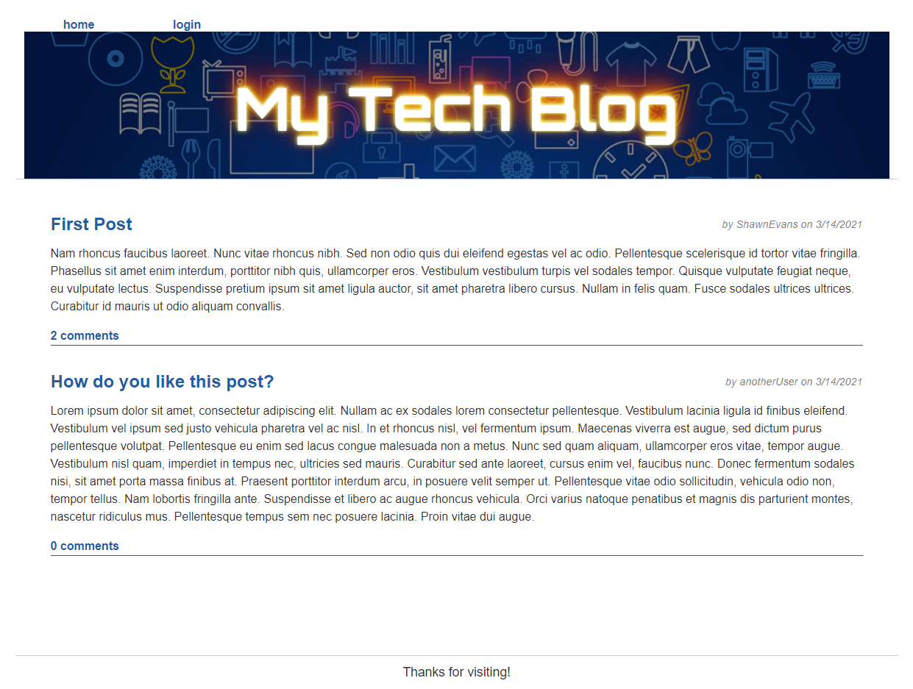

# Tech Blog

## Description

This is a simple blog website which allows for creation and management of accounts, publishing blog posts and a comments system. It is built on MySQL and Node.js

## Screenshot

## Table of Contents 

* [Installation](#installation)
* [Usage](#usage)
* [Demo](#demo)
* [License](#license)

## Installation

To install clone the repository, put in your own credentials to log into your local  MySQL database, personalize the Title, Layout and any other information, then run `npm install`. 

## Usage

This site could be nice for sharing info with friends or a small team. It currently can only make simple text string posts, but may in the future include support for images and markdown syntax.

## Demo
A live demo of this project is deployed at: http://bluesatyr-tech-blog.herokuapp.com/

## License

This project uses the MIT License. More info about this license can be found at https://opensource.org/licenses/MIT
    
## Questions

For additional information on this project contact me by email at shawnevans.music@gmail.com or visit my GitHub page at https://github.com/bluesatyr.
